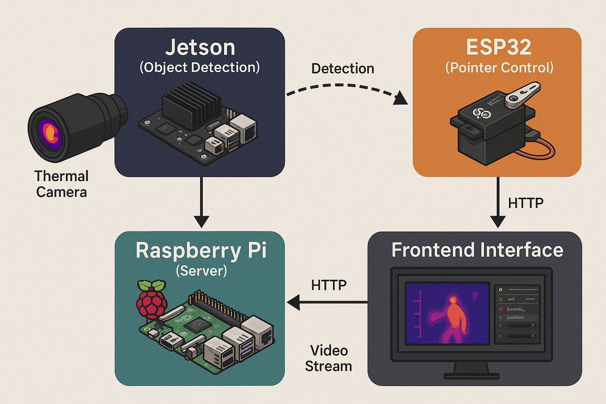

# Thermal Camera Fever Detection System 🤖🌡️

A thermal vision system designed for detecting elevated body temperatures in animals using a Raspberry Pi, Jetson, and ESP32-based laser pointer.

---

## 🔧 Components

- **Raspberry Pi**: Captures thermal feed, displays UI, and sends pointer commands.
- **Jetson Nano/Orin**: Performs real-time object detection and temperature calibration.
- **ESP32**: Controls servo motors for targeting.
- **Flask Web UI**: Real-time thermal feed and pointer configuration.

---

## 📦 Directory Structure

- `raspberry_pi/`: Flask app and device scanner.
- `jetson/`: Object detection and calibration modules.
- `arduino/`: ESP32 firmware for pointer control.
- `assets/`: Diagrams and infographics for documentation.

---

## 🖼️ System Diagram




---

## 🚀 Quick Start

1. Clone the repo:
```
   git clone https://github.com/zainalabidin85/thermalCamera.git
```
2. Run RaspberryPi App:
   ```
      cd raspberry_pi
      python3 v4_thermalCam.py
   ```
3. Run Jetson App
   ```
      cd jetson
      python3 v2_thermalNet.py --input http://<raspberry_pi_ip>:8080/video_feed
   ```
4. Flash esp32 code:
   Before flashing the thermalPointer.ino into your esp32. Please be make sure to change the SSID and Password accordingly.
   This thermalPointer.ino code uses Arduino.ide to flash.
```
const char* ssid = "your-network-name";  
const char* password = "your-network-password";
```
