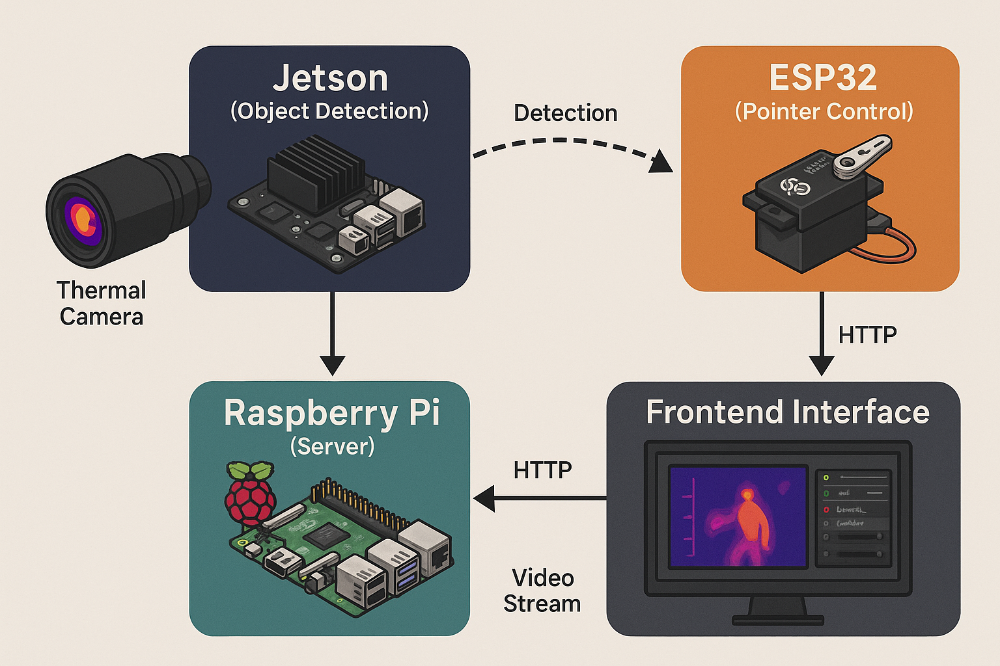

# Thermal Camera Fever Detection System

A thermal vision system designed for detecting elevated body temperatures in animals using a Raspberry Pi, Jetson, and ESP32-based laser pointer.

This repo is the **inference side** of a two-device pipeline:

- **thermalCam-Pi** (separate device + separate repo, not in this folder): a
  USB camera + MLX90614 IR point sensor on its own Raspberry Pi. It streams
  color-mapped video and answers per-point temperature estimates over HTTP
  (`/video_feed`, `/pixel_temp?x=<0-1>&y=<0-1>`, `/temperature_data`,
  `/system_status`). It owns all the sensor hardware and calibration math.
- **This repo**: pulls that video feed, runs YOLO species detection, asks
  thermalCam-Pi for the temperature at each detection, decides fever
  per-species, and drives the ESP32 laser pointer. Runs on a Raspberry Pi 5
  or a Jetson — no camera or MLX90614 attached here.

---

## 🔧 Components

- **thermalCam-Pi** (external device/repo): camera + MLX90614, serves video and per-point temperature over HTTP.
- **RPI/feverDetection.py** (this repo): pulls thermalCam-Pi's feed, runs YOLO species detection, evaluates fever, hosts the web UI, and sends pointer commands.
- **Jetson Nano/Orin**: alternate/secondary object detection node, also consumes thermalCam-Pi's feed.
- **ESP32**: Controls servo motors for targeting.
- **Flask Web UI**: Real-time thermal feed, live detection table, and pointer configuration.

---

## 📦 Directory Structure

- `RPI/`: `feverDetection.py` Flask app (species detection + fever stage via thermalCam-Pi's API + pointer control), device scanner, web UI. See `RPI/README.md`.
- `JETSON/`: Object detection and calibration modules.
- `esp32/`: ESP32 firmware for laser-pointer targeting.
- `assets/`: Diagrams and infographics for documentation.

---

## 🖼️ System Diagram




---

## 🚀 Quick Start

1. Clone the repo:
```
   git clone https://github.com/zainalabidin85/thermalCamera.git
```
2. Run the inference app, pointing it at your thermalCam-Pi device:
```
   cd RPI
   THERMALCAM_HOST=<thermalcam-pi-ip-or-hostname> python3 feverDetection.py
```
3. Run Jetson App
```
    cd JETSON
    python3 v2_thermalNet.py --input http://<raspberry_pi_ip>:8080/video_feed
```
4. Flash esp32 code:
   This firmware is a [PlatformIO](https://platformio.org/) project (targets a classic
   ESP32 dev board, `esp32dev`). No WiFi credentials need editing in code — with the
   PlatformIO CLI or VS Code extension installed:
```
    cd esp32/thermalPointer
    pio run --target upload
    pio device monitor
```
   On first boot (or after a `POST /wifi_reset`), the ESP32 opens its own WiFi network
   named `ThermalPointer-Setup` (no password). Connect to it from a phone or laptop — a
   captive-portal page should pop up automatically (or browse to `192.168.4.1`) — pick
   your real network and enter its password there. The ESP32 saves it and reconnects
   automatically on every future boot.
```

## License

MIT — see [LICENSE](LICENSE).
